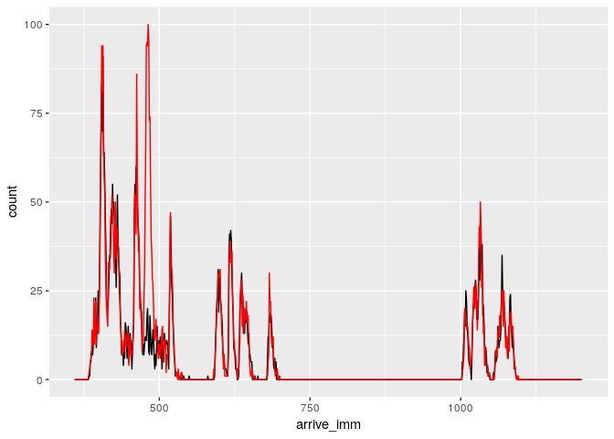
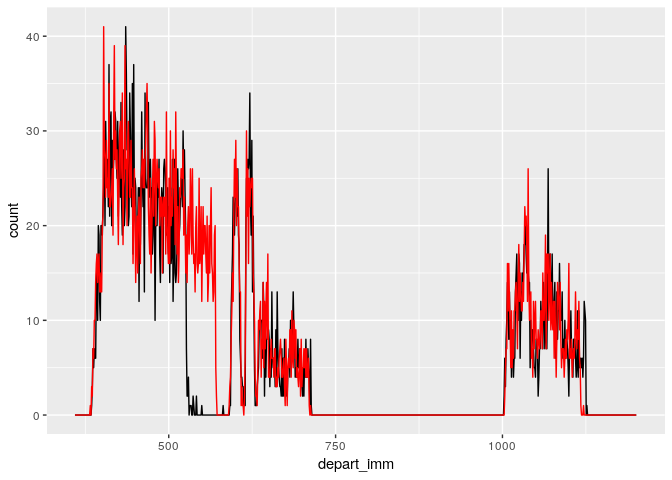

<!-- README.md is generated from README.Rmd. Please edit that file -->
DynamicQueueNetwork
====================

``` r
library(devtools)
install_github("ritiktaneja/DynamicQueueNetwork")
```

Data 
====
The following csv can be generated from model available at https://github.com/ritiktaneja/People-Counter
Let's look at all the data. We need data not only to fit parameters, but also to generate realisations - for example we need a flight schedule.

``` r
library(DynamicQueueNetwork)

flight_level
#>    flight arrive gate passengers locals
#> 1       1    378    1        331    216
#> 2       2    398    8        356    293
#> 3       3    401    6        314    262
#> 4       4    410   13        359    206
#> 5       5    411   10        304    155
#> 6       6    424    9        143     43
#> 7       7    436    3        150      7
#> 8       8    453   12        302    158
#> 9       9    456    7        282     90
#> 10     10    471    5        158     27
#> 11     11    482    2        151    126
#> 12     12    496    3        131     79
#> 13     13    512    6        199    135
#> 14     14    588   10        294    182
#> 15     15    612    7        309    108
#> 16     16    637    5        142    110
#> 17     17    630    6        188     52
#> 18     18    677   11        158     84
#> 19     22   1000    5        172     54
#> 20     23   1016    9        165     72
#> 21     24   1020   12        131     74
#> 22     25   1027   11        103     49
#> 23     26   1028    7        158    118
#> 24     27   1051    3        154    135
#> 25     28   1062    4        164     81
#> 26     29   1075   10        136    101
```

flight\_level\_disembark is the same as flight\_level with added columns for gamma parameters for disembarkation (Figure 4 in our paper). There are also gate level, nationality level, route level and global parameters.

``` r
flight_level_disembark
#>    flight arrive gate passengers  scale_dpl shape_dpl
#> 1       1    378    1        331     2.3252335  4.228507
#> 2       2    398    8        356     1.3200772  4.428346
#> 3       3    401    6        314     2.3521333  2.062755
#> 4       4    410   13        359     2.2014577  3.289913
#> 5       5    411   10        304     3.0245438  2.497207
#> 6       6    424    9        143     1.9424951  2.247516
#> 7       7    436    3        150     1.0575925  4.272311
#> 8       8    453   12        302     1.5235592  2.640128
#> 9       9    456    7        282     2.8724737  2.069624
#> 10     10    471    5        158     1.5278538  3.549109
#> 11     11    482    2        151     4.3363992  1.600835
#> 12     12    496    3        131     7.0318246  1.222569
#> 13     13    512    6        199     0.3568079 12.040226
#> 14     14    588   10        294     1.4793403  4.781123
#> 15     15    612    7        309     1.8610631  2.926935
#> 16     16    637    5        142     1.0691311  3.371627
#> 17     17    630    6        188     1.4028549  2.576323
#> 18     18    677   11        158     1.2511168  1.912668
#> 19     22   1000    5        172     1.5193965  2.671955
#> 20     23   1016    9        165     1.4506466  2.693533
#> 21     24   1020   12        131     1.2511168  1.912668
#> 22     25   1027   11        103     0.7466313  2.870579
#> 23     26   1028    7        158     2.2054247  2.098395
#> 24     27   1051    3        154     0.8171139  6.556052
#> 25     28   1062    4        164     0.4335216  7.364042
#> 26     29   1075   10        136     0.7002867  6.222155

gate_level
#>    gate distance_gate
#> 1     1           473
#> 2     2           406
#> 3     3           397
#> 4     4           274
#> 5     5           234
#> 6     6           157
#> 7     7            76
#> 8     8            77
#> 9     9           163
#> 10   10           202
#> 11   11           260
#> 12   12           319
#> 13   13           388


head(observations)
#>          key value
#> 1 arrive_imm   372
#> 2 arrive_imm   379
#> 3 arrive_imm   379
#> 4 arrive_imm   379
#> 5 arrive_imm   380
#> 6 arrive_imm   381

tail(observations)
#>                 key value
#> 20219 depart_imm_sg  1083
#> 20220 depart_imm_sg  1083
#> 20221 depart_imm_sg  1084
#> 20222 depart_imm_sg  1084
#> 20223 depart_imm_sg  1088
#> 20224 depart_imm_sg  1130
```

route\_level contains the service rate parameters since they vary by route and the walking parameters of interest are in global\_level . route\_level also contains a column called server\_imm which is the roster of when servers are available. observations contains all the data used for calculating MMD.

Simulate the passengers
=======================

``` r
passenger_df <- AirportSimulate1(global_level, flight_level_disembark, gate_level, nat_level, route_level)

passenger_df
#> # A tibble: 5,454 x 27
#> # Groups:   route [2]
#>    flight arrive  gate passengers  scale_dpl shape_dpl    ID
#>     <int>  <int> <int>      <int>         <dbl>     <dbl> <int>
#>  1      1    378     1        331          2.33      4.23     1
#>  2      1    378     1        331          2.33      4.23     2
#>  3      1    378     1        331          2.33      4.23     3
#>  4      1    378     1        331          2.33      4.23     4
#>  5      1    378     1        331          2.33      4.23     5
#>  6      1    378     1        331          2.33      4.23     6
#>  7      1    378     1        331          2.33      4.23     7
#>  8      1    378     1        331          2.33      4.23     8
#>  9      1    378     1        331          2.33      4.23     9
#> 10      1    378     1        331          2.33      4.23    10
#> # … with 5,444 more rows, and 19 more variables: distance_gate <int>,
#> #   nat <fct>, imm_sg <dbl>, imm_mg <dbl>, route <chr>, rate_imm <dbl>,
#> #   server_imm <list>, deplane <dbl>, arrive_ac <dbl>, walk_ac <dbl>,
#> #   arrive_imm <dbl>, service_imm <dbl>, depart_imm <dbl>,
#> #   system_dpl <dbl>, system_ac <dbl>, system_imm <dbl>,
#> #   system_total <dbl>, wait_imm <dbl>, start_imm <dbl>
```

The first few columns of this table all look the same since this is flight level information, but the later columns are different for each passenger.

We can change the input in this way.

``` r
flight_level2 <- flight_level_disembark
flight_level2$passengers[10] <- 1000

passenger_df_2 <- AirportSimulate1(global_level, flight_level2, gate_level, nat_level, route_level)
```

A lot happens in this function AirportSimulate1, to get a feel for how this works here's a simpler example with queuecomputer.

``` r
library(queuecomputer)

arrivals <- cumsum(rexp(10))
service <- rexp(10)

customers <- data.frame(arrivals, service)

customers
#>    arrivals   service
#> 1  2.005395 0.5322765
#> 2  2.550317 3.1519121
#> 3  2.610832 0.3807232
#> 4  2.628702 1.0502588
#> 5  2.975476 0.7316309
#> 6  3.964252 0.4071304
#> 7  4.778504 2.3627629
#> 8  5.279114 0.4005923
#> 9  6.643268 0.1993513
#> 10 7.501132 0.3029652

customers$departures <- queue(customers$arrivals, customers$service, servers = 2)

customers
#>    arrivals   service departures
#> 1  2.005395 0.5322765   2.537672
#> 2  2.550317 3.1519121   5.702229
#> 3  2.610832 0.3807232   2.991555
#> 4  2.628702 1.0502588   4.041814
#> 5  2.975476 0.7316309   4.773445
#> 6  3.964252 0.4071304   5.180575
#> 7  4.778504 2.3627629   7.543338
#> 8  5.279114 0.4005923   6.102821
#> 9  6.643268 0.1993513   6.842620
#> 10 7.501132 0.3029652   7.804098
```

The arrivals and departures from the airport model for immigration are shown below. Notice the big spike before time 500 for the red, since we changed the number of passengers on flight 10.

``` r
library(ggplot2)
ggplot(passenger_df) + aes(x = arrive_imm) + geom_freqpoly(breaks = 360:1200) + geom_freqpoly(data = passenger_df_2, breaks = 360:1200, col = "red")
```



``` r

ggplot(passenger_df) + aes(x = depart_imm) + geom_freqpoly(breaks = 360:1200) + geom_freqpoly(data = passenger_df_2, breaks = 360:1200, col = "red")
```


